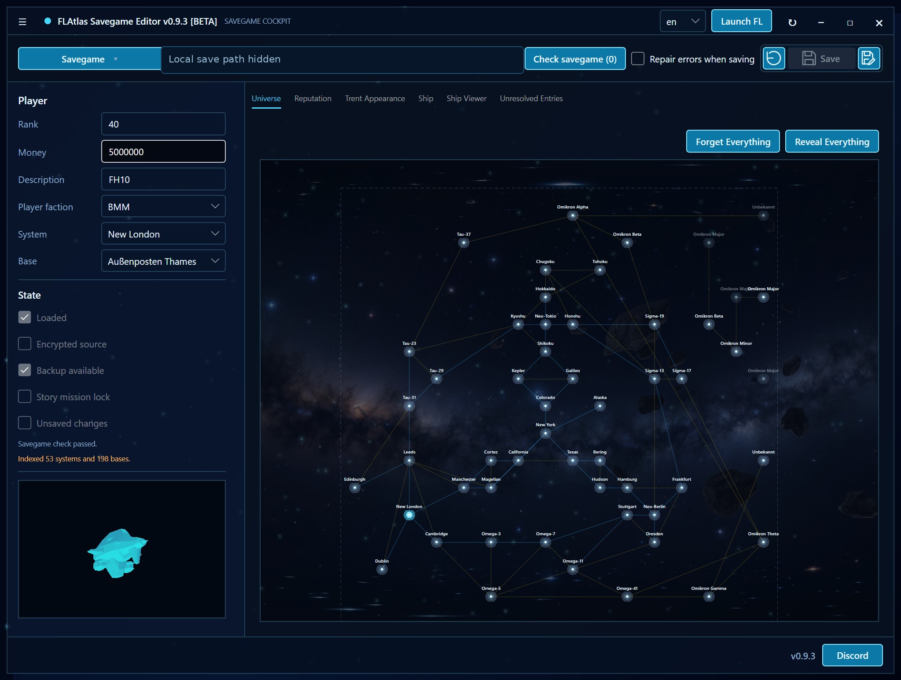

<h1 align="center">FLAtlas Savegame Editor</h1>

  <strong>Более безопасный редактор сохранений Freelancer для одиночной игры, модов и тестирования.</strong>

  <a href="README.md">English</a>
  |
  <a href="README.de.md">Deutsch</a>
  |
  <strong>Русский</strong>

  
  
  

  

## Скачать

| Сборка | Для кого | Скачать |
| --- | --- | --- |
| **Windows x64** | Большинство ПК с Windows | [FLAtlas-Savegame-Editor-v0.9.3-windows-x64.zip](https://github.com/flathack/FLAtlas---Save-Game-Editor/releases/download/v0.9.3/FLAtlas-Savegame-Editor-v0.9.3-windows-x64.zip) |
| **Windows ARM64** | Устройства Windows на ARM | [FLAtlas-Savegame-Editor-v0.9.3-windows-arm64.zip](https://github.com/flathack/FLAtlas---Save-Game-Editor/releases/download/v0.9.3/FLAtlas-Savegame-Editor-v0.9.3-windows-arm64.zip) |
| **Страница релиза** | Изменения, контрольные суммы, старые сборки | [GitHub Releases](https://github.com/flathack/FLAtlas---Save-Game-Editor/releases/tag/v0.9.3) |
| **Зеркало ModDB** | Страница загрузки для сообщества Freelancer | [FL Atlas Savegame Editor на ModDB](https://www.moddb.com/games/freelancer/downloads/flatlas-savegame-editor) |

Скачайте ZIP, распакуйте его в отдельную папку и запустите редактор из распакованной папки.

## Назначение

FLAtlas Savegame Editor — самостоятельный редактор файлов сохранений Microsoft Freelancer (`.fl`) для одиночной игры. Он помогает чинить сохранения, менять прогресс, тестировать комплектацию кораблей, проверять сохранения из модов и безопасно просматривать исходные данные сохранения.

Редактор читает игровые данные из выбранной установки Freelancer или мода, поэтому системы, базы, фракции, корабли, оборудование, товары, jump gates и jump holes отображаются в соответствии с вашей реальной установкой.

## Возможности

- Изменение кредитов, ранга, описания, текущей системы, текущей базы, фракции игрока и внешнего вида Трента.
- Просмотр и настройка корабля, основных компонентов, оборудования, hardpoints, оружия, щитов, thrusters, груза и товаров.
- Работа с репутацией, открытыми объектами, посещенными системами, заблокированными воротами и данными вселенной Freelancer.
- Распознавание названий из vanilla Freelancer, Freelancer HD Edition и модифицированных установок.
- Проверка сохранений с сохранением неизвестных или нераспознанных строк вместо их скрытого удаления.

## Безопасность

- Создает резервные копии перед записью изменений в сохранение.
- Сохраняет шифрованные `FLS1`-сохранения при записи.
- По возможности сохраняет неизвестные строки сохранения для обратимой записи.
- Блокирует рискованные действия, пока запущен Freelancer.
- Предупреждает о проблемах совместимости перед сохранением.

Рекомендуется дополнительно хранить личные резервные копии важных сохранений, особенно перед крупными экспериментальными изменениями.

## Примечание о публичном репозитории

Этот репозиторий GitHub является публичной страницей загрузки и информации для FLAtlas Savegame Editor. Файлы релизов публикуются через GitHub Releases. Разработка ведется приватно; полный исходный код намеренно не находится в этом публичном репозитории.

## Поддержка

Сообщения об ошибках, предложения функций и вопросы по релизам можно отправлять через [GitHub Issues](https://github.com/flathack/FLAtlas---Save-Game-Editor/issues).
